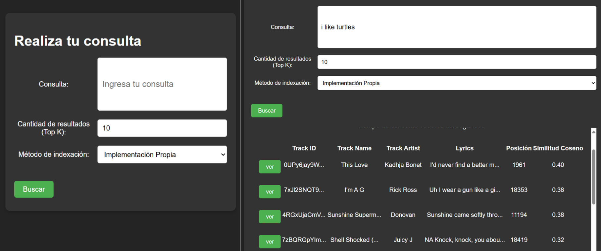
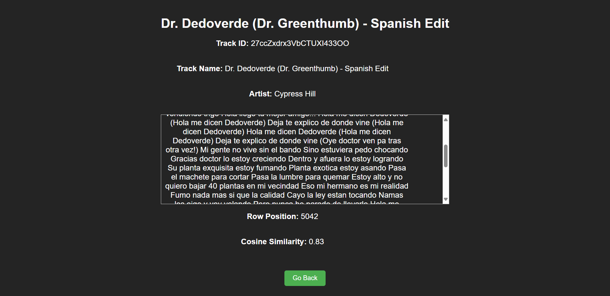

# Proyecto2

### Autores

- [Mariel Carolina Tovar Tolentino](https://github.com/MarielUTEC)  
- [Noemi Alejandra Huarino Anchillo](https://github.com/NoemiHuarino-utec)  
- [Sergio Sebastian Sotil Lozada](https://github.com/Sergio-So)  
- [Davi Magalhaes Eler](https://github.com/CS-DaviMagalhaes)  
- [Jose Eddison Pinedo Espinoza](https://github.com/EddisonPinedoEsp) 

## Introducción

### Objetivo

## Backend

Esta aplicación de backend está diseñada para manejar procesamiento, almacenamiento y recuperación de datos de canciones a gran escala. Incluye:

1. **Indexación Invertida Basada en SPIMI** para una recuperación eficiente de texto y cálculo de similitud de coseno.
2. **Integración con Base de Datos PostgreSQL** para almacenar metadatos de canciones y letras con un índice GIN.
3. **APIs** para realizar búsquedas y recuperar datos de canciones.

## 1. SPIMI (Single-Pass In-Memory Indexing)

La clase `SPIMI` gestiona la indexación a gran escala y la recuperación eficiente de letras de canciones utilizando un índice invertido. Incluye:

- **Carga de Datos**: Lee datos de canciones (ID de pista, nombre, artista y letras) desde un archivo CSV.
- **Preprocesamiento**: Tokeniza, elimina palabras vacías y realiza la derivación de palabras.
- **Construcción del Índice**: Divide los datos en bloques, indexa frecuencias de términos y calcula las normas de cada documento.
- **Similitud de Coseno**: Calcula la similitud entre la consulta y los documentos para devolver resultados relevantes.
- **Gestión de Archivos**: Guarda archivos de índice intermedios y los fusiona en un índice final almacenado en formato JSON.

### Ejemplo de Uso

Para inicializar y construir el índice, carga los datos desde un archivo CSV:

```python
spimi = SPIMI(csv_path='./backend/data/spotify_songs.csv')
query = 'hello'
result = spimi.busqueda_topK(query, k=5)
print(result)
```

El índice invertido final ordenado alfabeticamente es generado en el archivo `indiceFinal.json`, que además de las referencias a los documentos de cada palabra, también guarda las frecuencias y al final del archivo las normas. Por ejemplo:

```
{"diccionario": [["aconstumbr", [[1, 1], [10, 5]]], ["blood", [[3, 4], [7, 1]]], ... ], "normas": {"0": 4.723972227312666, "1": 2.9813075013013317, ... }}
```
- El token `"acostumbr"` ya fue preprocesado. En el primer documento aparece 1 vez, en el documento de id 10 aparece 5 veces. Como es el primer término su índice de norma seria `"0"`, con valor `4.723972227312666`.
- El token `"blood"` ya fue preprocesado. En el tercer documento aparece 4 veces, en el séptimo documento aparece 1 vez. Es el segundo término, su índice de norma es `"1"` con valor `2.9813075013013317`.

Si el archivo de índice ya existe el `SPIMI` solo lo utiliza. No necesita crearlo denuevo.

## 2. Integración con PostgreSQL

La clase `PostgresConnector` se encarga de manejar la conexión y las operaciones con una base de datos PostgreSQL. Esta clase facilita la carga de datos, la configuración de la base de datos y la realización de búsquedas eficientes utilizando índices GIN y vectores de búsqueda. A continuación, se describen los métodos principales y su uso:

### Métodos Principales

- **`connect`**: Conecta a la base de datos utilizando los parámetros de conexión proporcionados.
- **`setup_database`**: Configura la base de datos creando el esquema necesario, la tabla `spotify_songs`, el índice GIN para búsquedas de texto completo, la función `update_search_vector` para actualizar el vector de búsqueda y el trigger correspondiente.
- **`load_data`**: Carga datos desde un archivo CSV a la tabla `spotify_songs`. Antes de cargar los datos, verifica si ya existen datos en la tabla para evitar duplicados.
- **`search`**: Realiza una búsqueda en la tabla `spotify_songs` utilizando un vector de búsqueda. Devuelve los resultados ordenados por similitud en orden descendente. Los parámetros incluyen:
  - `query` (str): La consulta de búsqueda.
  - `k` (int): Número de resultados a devolver (por defecto 5).
  - Retorna un diccionario con el tiempo de consulta y los resultados.
- **`search_lyrics`**: Realiza una búsqueda en la tabla `spotify_songs` basada en un fragmento de letras. Devuelve los resultados ordenados por similitud en orden descendente. Los parámetros incluyen:
  - `lyrics_fragment` (str): Fragmento de letras para buscar.
  - `k` (int): Número de resultados a devolver (por defecto 5).
  - Retorna un diccionario con el tiempo de consulta y los resultados.

## 3. APIs

Los archivos de API (`api.py`, `api1.py`) exponen endpoints REST para interactuar con el backend y facilitar el acceso a los datos de canciones:

- **Endpoint de Búsqueda**: Este endpoint acepta un parámetro de consulta, que permite buscar en la base de datos de canciones y recuperar los mejores resultados en función de la similitud. 
- **Endpoints Adicionales**: Proporciona funcionalidades de consulta avanzadas, como la búsqueda por fragmento de letra o por atributos específicos de la pista.


## Frontend

Para correr el frontend localmente hacer lo siguiente en la terminal
- Entrar a la carpeta `Frontend`
- Correr los comandos `npm i` y `npm run dev`
- Entrar al link de `localhost` que aparece en la terminal

Utilizamos React con Typescript para hacer el frontend. Tenemos 3 componentes principales: 

`Home.tsx`: Página principal donde podemos ir a la página de consultas o visitar el repositorio del proyecto. Ruta `/`.


- `Consulta.tsx`: Página para hacer las consultas. Podemos elegir distintos métodos de indexación y customizar la cantidad de resultados que queremos para nuestra query personalizada. Ruta `/consulta`.



- `DetailPage.tsx`: Página para ver los detalles completos de una canción específica. Ruta `/details/trackId`.




## Pruebas Experimentales
